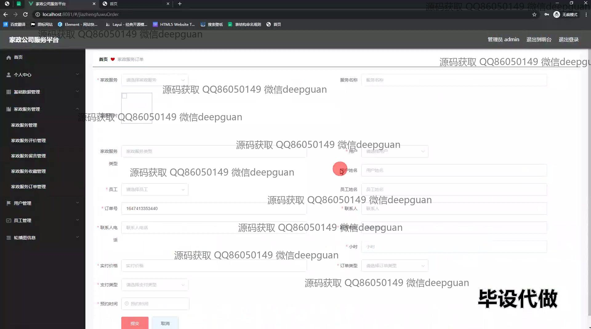
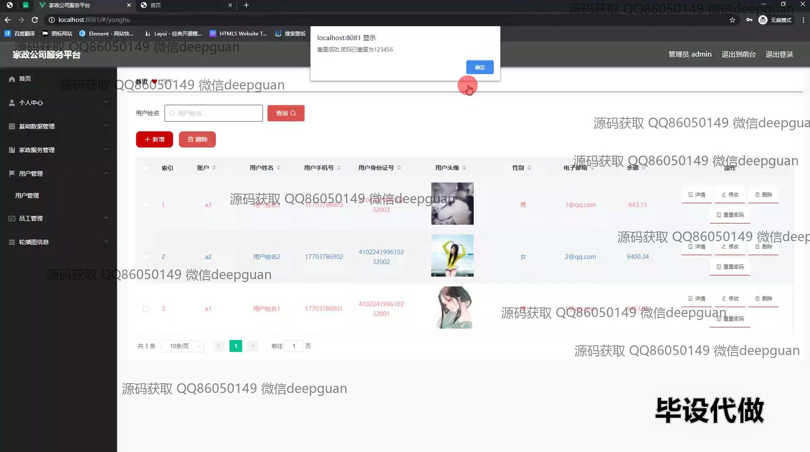

<h1 align="center">家政公司服务平台的设计与实现+vue</h1>

## 简介
家政服务平台：角色分为管理员、用户；功能包括家政服务管理、用户管理、员工管理、订单管理、评价管理、个人中心及在线预约等模块。    --计算机毕业设计源码；毕设源码；java毕业设计源码

## 联系方式

<h3 align="center">获取完整代码与数据库文件 + 微信：deepguan QQ: 86050149 QQ群: 783742310</h3>

<h3 align="center">可帮忙远程部署 包运行成功！提供远程部署、修改代码、设计文档指导、代码讲解等服务！</h3>

## 功能介绍（完整见运行截图）
管理员：基本功能包括登录、注册、退出，借助导航菜单实现用户、员工、服务管理，提供员工信息编辑和评价管理功能，支持新增、修改和删除操作，管理家政服务的分类、价格及上线状态，可查看和筛选家政服务订单，通过提示框进行操作确认。用户：通过登录界面进入平台，能查看或修改个人信息，浏览服务列表并在线预约家政服务，填写订单信息及进行支付，在个人中心查询历史订单并进行评价。员工：通过专属入口登录，能查看分配的服务订单，编辑个人及服务信息，通过评价管理了解用户反馈并回复。普通用户：在平台首页浏览服务概览，使用搜索功能精确查找服务，查看服务详情及预约服务，填写订单信息，进行在线支付，管理个人账户及查询服务记录。

## 运行截图

本代码来源于网络,仅供学习参考使用!

